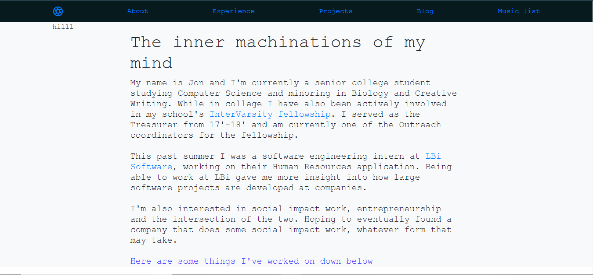

<h2>Taking A Look At My Past Sites</h2>

So this is about the third time I've worked on creating a
personal website. The first time I created my website was in
my freshman year of college as a means of trying to create a
portfolio and trying to test some coding skill. This is
an image of what the site initially looked like. 

   

From this image the site doesn't look too bad. However, the
rest of the site was not designed well. It had colored
backgrounds that loosely followed the color scheme set forth
by the initial background image. When designing my first
site I really wanted the first image to be the backdrop for the
site but didn't know how to setup the design for the rest of
the site. I still don't really know how to design but I
would like to think I've gotten slightly better since
freshman year. Or at the very least have better judgment
when it comes to design choices. Except for the use of
bootstrap I wanted to code this iteration of my site from
the ground up. At the time I was hoping this would be a good
side project to teach me more about web design but to be
honest I didn't really know much about design practices.
Frankly, I still don't. 

But let's take a look at what the second iteration of this
site looks like to see the progression. 

   

This site is a bit different than the first but there are a
few shared aspects. The first commonality between the sites
is the horizontal navbar on the top of both sites. The
second is that both of my sites have a welcome banner for
whoever may be visiting my site. The banner in the v2 of my site makes me cringe
but I also felt it was needed for a personal website at the time.
After going through two iterations for this site and looking
at dozens and dozens of other personal websites on the
Internet I think I've started to learn some of the design
aspects I appreciate in personal websites. First, I
appreciate if a website has a minimal theme. In my first
website I believe I stuck to that thought with just a
minimal navbar and background picture as the center piece.
No flashy animations, no extremely vibrant colors, just a
simple image with navigation for the site (with a few other
div's that hold some content). So I think that was something
I wanted to have in my latest iteration of the site.
However, I still had one issue that was holding me back. I
still didn't really know much about design. Over time
I decided to switch over to using a static site
generator (jekyll) with a pre-built theme. Instead of
trying to design one myself. That's how I finally came to
using jekyll along with the 
<a href="https://github.com/niklasbuschmann/contrast"> contrast theme</a>.
I edited a few things myself, just small things like
changing the color of the footer and adding a reading time
for each of my blog posts. So slowly this site started to
morph into my own, reflecting my taste and personality.
After a while it finally felt like I can settle on a site
that I'm comfortable with.
  
At least that's what I had thought at the time. But even
after switching over from static html/css to a static site
generator, I eventually felt like I wanted a new theme.
After looking over many personal websites online and drawing
inspiration from particularly two (which I've given credit
to on my site) I settled on the gravity theme with a bit of
customization. 
  
This theme is definitely closer to what I would like out of
this site but there is still more tinkering I can do with
it. Hopefully I will be able to make some more updates soon.
I'm planning to make one of the first updates to this site
be a dark theme (one that can be toggled).

